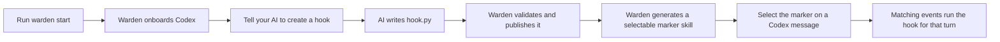

# Warden

Warden adds turn-scoped, user-authored hooks to Codex. A hook is a local Python function that can
react to user prompts, tool calls, tool results, assistant responses, and turn lifecycle events. It
can run ordinary Python, call a fresh or persistent Claude/Codex session, and—when explicitly
granted—inspect or control Codex through Warden actions.

You normally do **not** write hook files yourself. Start Warden, then tell your Codex AI what hook
you want. Warden installs an authoring skill that teaches the AI how to create it correctly.



## Requirements

- macOS with Codex Desktop installed and signed in.
- Rust 1.91 or newer and Cargo.
- Python 3.11 or newer, available as `python3` by default.
- For agent-backed hooks, an installed and authenticated `claude` or `codex` CLI for the provider
  the hook uses.

Warden currently integrates with Codex. Its hooks and dependencies execute as your local user; they
are isolated for dependency management, but they are not security-sandboxed.

## 1. Install the CLI

From this repository:

```bash
./install.sh
```

The installer builds and places `warden` and its internal daemon companion in Cargo's binary
directory, normally `~/.cargo/bin`. If `warden --version` is not found afterward, add that directory
to `PATH`.

To install an updated checkout, run `./install.sh` again. You should not use `cargo run` for normal
operation and should not invoke `warden-daemon` directly.

## 2. Start Warden

Run Warden from an independent Terminal window and leave it running:

```bash
warden start
```

Startup is also the idempotent Codex onboarding flow. It:

- creates Warden's local directories under `~/.warden`;
- installs or updates the global `create-warden-hook` Codex authoring skill;
- installs and trusts Warden's four generic Codex bridge hooks;
- attaches Warden's generated marker-skill directory to Codex; and
- starts watching authored hooks and ingesting Codex events.

Running startup again is safe. It preserves authored hooks, generated markers, unrelated Codex
skills, and unrelated native hooks. Normal startup only attaches to Codex's shared app-server; it
does not quit or restart Codex Desktop.

In another terminal, verify the connection:

```bash
warden health
```

Look for `"phase": "connected"`. Under `daemon.bridge`, `configured`, `trusted`, and
`loaded_confirmed` should be `true`. If `restart_required` is `true`, start a new Codex task or
deliberately restart Codex before expecting blocking hooks to pause an already-running task. Hook
code itself hot-updates after the generic bridge has loaded.

### Only when Codex is not attached

If normal startup cannot attach Codex Desktop to the shared app-server, stop Warden and run this
from an independent macOS Terminal—not from a Codex-owned terminal or task:

```bash
warden start --manage-gui
```

This explicit option may gracefully quit and relaunch Codex Desktop. Warden refuses it when its
process ancestry belongs to Codex or ChatGPT, because quitting the parent app could also kill the
process responsible for relaunching it.

## 3. Ask your AI to create a hook

In Codex, describe the behavior in ordinary language. For example:

> Create a Warden hook named `review-final-answer`. On each selected turn, send the completed final
> assistant response to a fresh Claude session and ask it to identify unsupported claims. Make it
> non-blocking and do not grant it any Warden actions.

The installed `create-warden-hook` skill should be selected automatically from that request. You can
also explicitly select or mention `$create-warden-hook` in the prompt. The AI will create the hook
under:

```text
~/.warden/warden-hooks/<hook-name>/hook.py
```

Tell the AI the following when they matter; otherwise it will ask or use the safe default:

- **Events:** user prompt, turn start, before a tool, after a successful or failed tool, completed
  assistant response, or completed/failed/interrupted turn.
- **Blocking:** whether Codex must wait for the hook. The default is non-blocking.
- **Agent:** no agent, fresh Claude/Codex inference for every matching event, or a named persistent
  session that retains context across selected turns.
- **Dependencies:** any third-party Python packages the hook needs.
- **Warden actions:** which Codex observation or control actions an agent-backed hook may call.
  `None` is the default; cross-task access is never inferred.

Some more example requests:

> Create a non-blocking Warden hook named `tool-audit` that runs ordinary Python after every
> successful tool result in a selected turn. It should append the tool name and result status to a
> local JSONL file. It does not need an agent or Warden actions.

> Create a Warden hook named `architecture-monitor` that sends selected user prompts and completed
> assistant responses to one persistent Claude session per Codex task. Ask it to track architectural
> decisions. Make it non-blocking and grant no Warden actions.

> Create a Warden hook named `pop-interrupt` that runs on selected user prompts, starts a fresh
> Claude inference without prior history, and interrupts the current Codex turn when the human text
> contains the exact phrase `POP`. Grant only the current-turn interrupt action.

The AI should edit only the authored hook. It must not create a Codex native hook or marker skill.
Warden watches the authored files, validates them, prepares dependencies, and generates the marker
automatically at:

```text
~/.warden/generated-skills/<hook-name>/SKILL.md
```

There is no reload command. Valid additions and edits are hot-published; an invalid edit leaves the
last valid revision active.

## 4. Activate the hook on a message

Creating a hook does not make it run on every Codex task automatically. In the Codex prompt box,
open the skills/slash-command picker and select the generated skill named after the hook. Then send
your message.

For a hook named `review-final-answer`, select `review-final-answer`. Codex inserts a marker similar
to:

```text
[$review-final-answer](/Users/you/.warden/generated-skills/review-final-answer/SKILL.md)
```

The marker contains no behavior; it tells the running Warden service which authored hook to activate.
No `warden-` command prefix is required.

Activation lasts for **that user message and its turn only**. The active hook may receive every
matching event configured for that turn. If you want it on the next message, select the marker again.
Even a persistent Claude or Codex session receives no events from an unmarked turn.

There is no `/hooks` command. Warden hook markers appear through Codex's skill picker because they
are generated skills.

## Blocking and non-blocking hooks

- A **non-blocking** hook is scheduled on Warden's bounded background queue. Codex continues without
  waiting.
- A **blocking** hook makes Warden wait for completion. At native `UserPromptSubmit`, `PreToolUse`,
  successful `PostToolUse`, and final assistant-response boundaries, that also pauses Codex itself.
- Failure and terminal events can still be processed in order, but cannot pause work that already
  finished.

Blocking is configured per hook and works for every supported event kind, subject to whether Codex
provides a synchronous native boundary for that event.

## Updating or removing a hook

Tell your AI what to change:

> Update my `review-final-answer` Warden hook so Claude also checks for contradictory requirements.

Warden publishes valid edits for later activations without restarting the daemon or existing Codex
tasks. In-flight executions keep the immutable revision with which they started.

For recoverable removal, ask the AI to move the hook directory outside `~/.warden/warden-hooks/`.
Warden will remove its generated marker and prevent new activations. Moving the directory back
restores it.

## Troubleshooting

Start with:

```bash
warden health
```

Then check:

1. `phase` is `connected`, and `daemon.bridge` reports the bridge configured, trusted, and loaded.
2. `hooks_ready` increases after publication and `hook_failures` does not report the hook name.
3. `~/.warden/warden-hooks/<name>/hook.py` exists.
4. `~/.warden/generated-skills/<name>/SKILL.md` appeared after validation.
5. You selected that generated marker on the exact message being tested.
6. The terminal running `warden start` has no dependency, import, timeout, provider, or permission
   error for the hook.

If a generated marker is missing, fix the authored hook; do not create or repair the marker by hand.
If the marker is not visible in a prompt that was already open, open the skill picker again or start
a new Codex task after confirming the generated file exists.

## CLI reference

```bash
warden start [--home PATH] [--python PATH] [--manage-gui]
warden health
warden --socket PATH health
warden action <name> --arguments '{}'
warden remove-native-bridges [--home PATH]
```

`warden action` is primarily for authenticated hook/agent subprocesses. Invocation credentials and
declared grants restrict what it can call.

To remove only Warden-owned native bridge entries, first stop Warden and then run:

```bash
warden remove-native-bridges
```

Unrelated native hooks remain untouched. Existing Codex tasks may retain an already-loaded bridge
until they restart.

## Advanced manual authoring

AI-assisted creation is the normal workflow. If you need to inspect or hand-author a hook, this is
the minimum shape:

```python
from warden import HookEvent, HookEventKind, hook


@hook(on=[HookEventKind.POST_TOOL_USE], blocking=False)
def observe_tool(event: HookEvent) -> None:
    print(event.payload)
```

Create only `hook.py` unless the hook requires third-party dependencies, in which case place a
`requirements.txt` beside it. Reusable local Python modules belong in `~/.warden/modules/`. For the
full event model, provider sessions, action grants, dependency behavior, and rollback rules, read
[Authoring and operating Warden hooks](docs/hooks.md).

Implementation proposals and decisions are under [OpenSpec](openspec/changes/).
