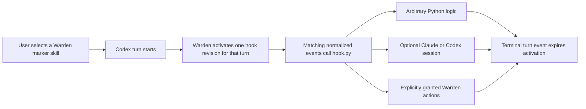

# Warden hooks

Warden hooks are local Python functions that receive normalized events from a running Codex task. A hook runs only for a turn whose user input includes that hook's Warden-generated marker skill.



## Files and ownership

`WARDEN_HOME` defaults to `~/.warden`. Warden keeps authored input separate from generated and managed state:

```text
warden-hooks/          authored hook directories
modules/               reusable local modules
generated-skills/      daemon-generated activation markers
runtimes/              cached Python environments and immutable revisions
sessions/              persistent provider session metadata
installations/          manifests for Warden-owned Codex integration files
native-hooks/           fixed generic Codex bridge program
bridge-auth             owner-only native bridge credential
warden.sock            local daemon API socket
```

Create `warden-hooks/<name>/hook.py`. Add `requirements.txt` beside it only when the hook needs third-party packages. Do not add a YAML hook definition, process-lifetime setting, event-to-prompt transform, generated skill, or hook-specific Codex native hook entry. Warden startup owns the fixed native bridge entries.

For every valid authored hook, Warden generates `generated-skills/<name>/SKILL.md`. Its Markdown instruction body is exactly:

```text
This skill is an activation marker for the local Warden service. Ignore
```

The marker contains no hook behavior. Warden attaches the generated root to its managed app-server and refreshes skill discovery after valid additions, updates, removals, and reconnects. Select the marker on each user message that should activate the hook. Current Codex Desktop app-server frames represent that UI selection as a leading `[$name](absolute/SKILL.md)` marker link; Warden canonicalizes the link target and accepts it only beneath its generated-skill root. A persistent provider session may survive between activations, but Warden sends it no events from an unmarked turn.

## Minimal hook

Export exactly one function decorated with `@hook`. The function may be synchronous or asynchronous and must accept `event`. Add the optional `warden` argument only when calling the host client directly:

```python
from warden import HookEvent, HookEventKind, hook


@hook(on=[HookEventKind.POST_TOOL_USE])
def record_tool_result(event: HookEvent) -> None:
    print({
        "sequence": event.sequence,
        "item_id": event.item_id,
        "payload": event.payload,
    })
```

`blocking` defaults to `False`. Set `blocking=True` when Warden must wait for this hook. At native
`USER_PROMPT_SUBMITTED`, `PRE_TOOL_USE`, successful `POST_TOOL_USE`, and final
`AGENT_MESSAGE_COMPLETED` boundaries, that wait holds Codex itself. For observer-only failure,
terminal, unknown, or non-final assistant events, it only preserves Warden's processing order; it
cannot pause work that already finished. Blocking hooks for one event run concurrently. Non-blocking
hooks use a bounded background queue, and saturation is reported instead of spawning unlimited work.

Warden supplies the incoming event automatically. The object contains:

- `sequence`: backward-compatible delivery ordering value.
- `origin`: `native` for a synchronous bridge delivery or `observed` for app-server ingestion.
- `source_sequence`: authoritative app-server sequence when observed, otherwise `None`.
- `receipt_ordinal`: Warden's local receipt ordering value.
- `native_event_name`: exact Codex hook name when native.
- `kind`: stable normalized `HookEventKind`.
- `thread_id`, `turn_id`, and optional `item_id`.
- `payload`: normalized event data.
- `raw_method` and `raw_payload`: preserved upstream data for fields not normalized yet.

Hooks can use arbitrary Python logic and import reusable modules normally. Built-in provider helpers live under `warden.modules`. Put your own shared `.py` modules in `WARDEN_HOME/modules/` and import them by module name; Warden snapshots that directory into each immutable hook revision, so a module edit is hot-published for later activations without changing an in-flight revision. Return `None` or another JSON-serializable value. Warden supervises each immutable hook revision so a hook exception, timeout, crash, or malformed result does not terminate unrelated hooks or the daemon.

Built-in action facades live under `warden.modules.tools`. They use the authenticated client for the current invocation and remain constrained by the hook's declared action grants:

```python
from warden import HookEventKind, WardenAction, hook
from warden.modules import tools


@hook(
    on=[HookEventKind.USER_PROMPT_SUBMITTED],
    actions=[WardenAction.TURN_INTERRUPT],
)
async def stop_this_turn(event, warden) -> None:
    await tools.interrupt_turn(warden=warden)
```

The same actions are available to an agent subprocess through the authenticated `warden action <name>` CLI. The facade and CLI do not expand authority: undeclared actions are rejected by the Rust gateway.

## Event kinds

| Python enum | Meaning |
| --- | --- |
| `USER_PROMPT_SUBMITTED` | Native `UserPromptSubmit` barrier when available; otherwise observed submitted input. |
| `TURN_STARTED` | Native turn-start view from `UserPromptSubmit`, deduplicated against later observation. |
| `PRE_TOOL_USE` | Native `PreToolUse` barrier before tool execution when available. |
| `POST_TOOL_USE` | Native `PostToolUse` barrier after successful tool completion when available. |
| `POST_TOOL_USE_FAILURE` | Terminal tool-item data indicates failure. |
| `AGENT_MESSAGE_COMPLETED` | Native `Stop` barrier for the final assistant message; other assistant messages are observed. |
| `TURN_COMPLETED` | The source turn completed successfully. |
| `TURN_FAILED` | The source turn failed. |
| `TURN_INTERRUPTED` | The source turn was interrupted. |
| `UNKNOWN_UPSTREAM_EVENT` | An upstream message is preserved but does not match a known Warden kind. |

Terminal turn events are delivered to an already-active matching hook, then the activation expires. Selecting a marker in one message never carries activation into the next message.

## Optional dependencies and trust

Put normal pip requirement lines in `requirements.txt`:

```text
httpx==0.28.1
```

Warden builds an isolated cached virtual environment from the runtime contract and dependency content. A changed requirement produces a candidate environment before publication. If installation or import fails, Warden reports the candidate failure and keeps the last valid revision when one exists.

Isolation avoids dependency collisions; it is not a security boundary. Package installation can execute build logic, and the hook process runs as the local user. Review and trust the hook code, dependency names, versions, and sources. Warden does not claim to restrict the hook's filesystem, network, shell, or process access.

## Fresh and persistent agent sessions

Use `warden.modules.claude` or `warden.modules.codex` when the hook needs local agent inference. Both providers receive the full event as the next user message; the `prompt` is standing monitoring guidance.

Fresh inference is the default:

```python
from warden import HookEventKind, hook
from warden.modules import claude


@hook(on=[HookEventKind.AGENT_MESSAGE_COMPLETED])
async def review(event) -> None:
    await claude.run(event, prompt="Find unsupported claims in this response.")
```

Each `run` call starts without conversational state from an earlier call. Use `codex.run` for the same behavior through the Codex CLI.

Choose a named persistent session only when accumulated context is intentional:

```python
from warden import HookEventKind, hook
from warden.modules import claude


monitor = claude.session(
    "architecture-monitor",
    prompt="Track architectural decisions and contradictions.",
)


@hook(on=[HookEventKind.USER_PROMPT_SUBMITTED, HookEventKind.AGENT_MESSAGE_COMPLETED])
async def monitor_architecture(event) -> None:
    await monitor.send(event)
```

Persistent sessions are keyed by provider, hook, session name, and source Codex task. Sends are serialized in source order. They can retain growing context and incur growing usage, so keep persistence explicit and use session status or reset operations when needed. Warden durably records an in-progress send before invoking the provider and publishes the resulting session state before advancing its in-memory cursor. If that commit becomes ambiguous, the session fails observably and remains unavailable across daemon restarts until it is explicitly reset; unrelated sessions continue normally.

## Warden action grants

Action grants limit which daemon-owned Codex observation and control operations a hook invocation or its agent may call. They do not sandbox the agent process.

Declare only needed actions in the hook decorator:

```python
from warden import HookEventKind, WardenAction, hook
from warden.modules import codex


@hook(
    on=[HookEventKind.TURN_FAILED],
    actions=[
        WardenAction.CURRENT_EVENT,
        WardenAction.CURRENT_THREAD_HISTORY,
    ],
)
async def diagnose_failure(event, warden) -> None:
    await codex.run(event, prompt="Diagnose this failure using only granted Warden context.")
```

Current-scope actions infer their target from the invocation credential:

- `CURRENT_EVENT`
- `CURRENT_THREAD_SNAPSHOT`
- `CURRENT_THREAD_HISTORY`
- `TURN_START`
- `TURN_STEER`
- `TURN_INTERRUPT`

Cross-thread actions must be selected deliberately:

- `THREAD_LIST`
- `ARBITRARY_THREAD_SNAPSHOT`
- `ARBITRARY_THREAD_HISTORY`
- `ARBITRARY_TURN_START`
- `ARBITRARY_TURN_STEER`
- `ARBITRARY_TURN_INTERRUPT`

The daemon rejects ungranted commands and rejects another task identifier supplied to a current-scope action. Control results preserve confirmed, rejected, and outcome-unknown states; an ambiguous write is not silently retried or reported as success.

When using the `create-warden-hook` skill, Codex asks for this action selection only for a hook that invokes Claude or Codex. `None` is the default, and cross-thread access is never inferred.

## Updates and diagnostics

Warden watches authored source and `requirements.txt`. It validates a candidate, prepares dependencies, generates the marker, and then publishes an immutable revision atomically. An invalid candidate leaves the last valid revision active. Warden restores that revision from an integrity-checked manifest after a daemon restart before evaluating newer authored bytes. An in-flight activation retains the revision with which it started; a later marked turn uses the newly published revision.

Use these checks when a hook does not appear or run:

1. Run `warden health`. Check the connection phase, reconnect count, last source sequence, detail text, and active invocation count.
   Under `daemon.bridge`, also check exact trust, loaded tasks, and restart readiness. Under
   `dispatcher`, check queued, active, and rejected non-blocking counts.
2. Confirm `WARDEN_HOME/warden-hooks/<name>/hook.py` exists and exports exactly one decorated function accepting `event`, with `warden` as an optional second argument.
3. Read daemon logs for the hook name, candidate revision, source sequence, and invocation failure. Dependency, import, timeout, worker, provider, and authorization errors are isolated and reported there.
4. Confirm `WARDEN_HOME/generated-skills/<name>/SKILL.md` exists. Do not repair it by hand; fix the authored candidate or daemon connection and let Warden regenerate it.
5. Confirm the marker was selected in the specific Codex message being diagnosed. Earlier selection does not activate a later turn.

There is no manual hook reload command. Saving the authored files triggers validation and refresh automatically.

## Verification

The normal Rust and Python suites use isolated Codex and Warden homes and never edit the installed
`~/.codex/hooks.json`. The ignored macOS test is intentionally live: it requires a running, trusted
Warden daemon and an authenticated local Codex CLI, creates one temporary hook, starts one ephemeral
Codex inference, measures the native pause, hot-updates the hook, and removes it afterward:

```bash
WARDEN_LIVE_TEST=1 cargo test --test live_native_blocking -- --ignored --nocapture
```

## Removal and rollback

Prefer a recoverable removal:

1. Move `WARDEN_HOME/warden-hooks/<name>/` to a backup path outside `warden-hooks/`.
2. Let the watcher remove its generated marker and refresh the managed skill root. No new turn can activate the removed hook.
3. Allow an existing invocation to reach its terminal source event when its immutable runtime remains available; otherwise expect an observable invocation failure.

Restore the backed-up directory to re-create the hook. To roll back an undesired valid edit, restore the earlier `hook.py` and `requirements.txt`; Warden publishes their content as the next valid revision. If a new edit is invalid, no manual rollback is needed because the last valid revision remains current.

To disable native bridging safely, stop Warden and run
`warden remove-native-bridges`. Warden parses Codex's configuration, atomically removes only
entries carrying its stable status identity, and preserves unrelated hook ordering and contents. It
leaves the bridge program and credential in place so a task that already captured the command fails
open until restarted. Authored hooks and provider session metadata remain available for recovery.
