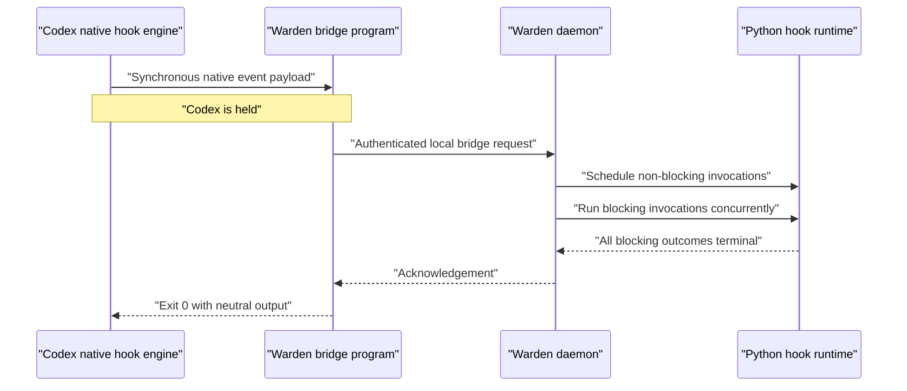

## Context

See `proposal.md` for motivation and `specs/blocking-hook-execution/spec.md` for the behavioral contract.

Warden currently receives `Arc<SequencedEvent>` notifications from `codex-control` after Codex has emitted them. The event router synchronously joins every delivery task, but that only delays Warden's consumer loop; the Codex app-server is a peer and continues independently. Current `PreToolUse` is therefore an observation of `item/started`, not an interception point.

The installed Codex version has a separate native hook engine. Command handlers are either synchronous or asynchronous; synchronous handlers are awaited inside Codex at event-specific boundaries such as `UserPromptSubmit`, `PreToolUse`, `PostToolUse`, and `Stop`. Native hook definitions and trust are discovered from Codex configuration and are captured by a loaded task, while their `hooks/list` metadata and exact-hash trust state can change independently.

The workspace contains partial, unshipped code from an interrupted spike: `blocking` metadata, a `UserPromptSubmit`-only bridge, native hook trust operations in the local dependency checkout, and a temporary path dependency. The apply phase must audit and reshape that code to this design rather than treating the spike as complete.

## Goals / Non-Goals

**Goals:**

- Give every Warden hook one simple execution-mode flag with a non-blocking default.
- Hold Codex at real synchronous native boundaries for event kinds with an exact bridge mapping.
- Preserve per-message marker activation, immutable hook revisions, hot reload, action grants, and bounded process use.
- Keep native configuration stable after bootstrap and preserve unrelated user hook definitions and trust.
- Make readiness, failure, timeout, and observer-only limitations explicit and testable.

**Non-Goals:**

- Give `blocking=True` an allow/deny/rewrite meaning. It controls waiting only; existing Warden actions remain the explicit control mechanism.
- Claim that a terminal notification can retroactively pause a completed, failed, or interrupted operation.
- Generate one native Codex definition per authored Warden hook.
- Globally bypass Codex hook trust, silently restart Codex Desktop, or replace the GUI submission path.
- Add routine timeout, worker-lifetime, event-transform, or bridge configuration to individual hook declarations.

## Decisions

### 1. Use one Boolean on the published hook revision

The Python interface is:

```python
@hook(on=[HookEventKind.PRE_TOOL_USE], blocking=True)
async def inspect(event):
    ...
```

`blocking` defaults to `False`, is validated as a Boolean, crosses the worker handshake, and is stored in `HookMetadata`. Because activations snapshot an immutable `HookRevision`, changing execution mode affects later activations and never changes an invocation already in flight.

Per-event execution-mode maps and process-lifetime settings were rejected. They add configuration without a demonstrated need and make one hook's scheduling behavior harder to reason about.

### 2. Manage a fixed native bridge bundle

Warden installs one identifiable command handler for each native boundary used by the current normalized event set. Every handler invokes the same small standard-library bridge program. The native payload already includes its hook event name, thread/session ID, turn ID, and event-specific correlation fields, so the bridge only validates input, attaches its bridge credential, sends one bounded request to the Warden Unix socket, waits for one response, and exits.



Initial exact mappings are:

| Native boundary | Warden delivery |
| --- | --- |
| `UserPromptSubmit` | `USER_PROMPT_SUBMITTED` and the turn-start view before model work begins |
| `PreToolUse` | `PRE_TOOL_USE` before tool execution |
| `PostToolUse` | successful `POST_TOOL_USE` before Codex continues |
| `Stop` | final `AGENT_MESSAGE_COMPLETED` when `last_assistant_message` is present |

`POST_TOOL_USE_FAILURE`, terminal turn notifications, unknown events, and any agent-message completion without an exact native payload remain observer-backed. The mapping is version-capability data in Warden, not author configuration. A later Codex version can promote an observer event to barrier-backed behavior after a compatibility test proves an exact synchronization point.

Installing every native event currently exposed by Codex was rejected. Events such as `SessionStart` occur before a per-message marker can be known, and adding unused bridge processes would increase latency and hook-review surface without satisfying marker-scoped behavior.

### 3. Keep authored hooks and marker skills separate from native bridges

The three artifacts have different jobs:

```text
generated-skills/<hook>/SKILL.md   selects one authored hook for this message
warden-hooks/<hook>/hook.py        contains the user's dynamic behavior
native-hooks/bridge.py             gives Warden a stable Codex wait point
```

The bridge bundle never embeds hook names or logic. Adding, updating, or removing authored hooks changes Warden's registry and generated marker projection only. Once a task has loaded the stable bridge bundle, it can use later Warden revisions without native hook reload.

### 4. Activate from the native user-prompt payload

`UserPromptSubmit` contains the full prompt, including Codex's selected-skill marker representation. Warden canonicalizes marker paths against `generated-skills/`, resolves current revisions, and creates activation records keyed by hook ID, revision, thread, and turn before dispatching prompt or turn-start hooks. This is earlier than the later `turn/started` observation and preserves the rule that activation applies only to that message.

Other bridge requests must find an existing activation for the exact thread and turn. A forged hook name in a bridge request cannot activate anything, and a marker from a previous turn is never consulted.

### 5. Introduce logical event identity and source origin

A native request has no app-server receipt sequence yet, so it must not masquerade as an authoritative `SequencedEvent`. `HookEvent` gains an origin that can preserve either the existing shared app-server source or the exact native hook payload. The serialized envelope retains existing observed-event fields and adds origin, native event name, an optional app-server source sequence, and a daemon-assigned receipt ordinal for total local delivery order.

Logical deduplication uses stable correlation data rather than comparing the synthetic and app-server sequences:

```text
thread + turn + normalized kind + tool/item correlation ID
```

For prompt and turn-start views, thread and turn are sufficient. Tool events use `tool_use_id`/item ID after normalization. The activation record stores delivered logical identities and their origin. A later observer notification enriches diagnostics when useful but does not invoke the same hook revision twice.

Creating fake sequence zero events was rejected because repeated native events would have ambiguous order and sequence-based replay logic would become accidental deduplication policy.

### 6. Partition dispatch without unbounded task growth

For one logical event, Warden resolves matching deliveries once and partitions them by the revision's `blocking` flag.

- Non-blocking deliveries enter a bounded supervised invocation queue. Successful enqueue is enough to release the event path; queue saturation becomes an observable isolated failure rather than an unbounded Tokio task or provider-process spike.
- Blocking deliveries acquire bounded runtime capacity, start concurrently, and are awaited as a group under the existing per-invocation timeout and cancellation rules.
- Observer-backed blocking deliveries are awaited by Warden's ordered routing path. Observer-backed non-blocking deliveries are enqueued and routing continues immediately.

The bridge deadline must be longer than Warden's maximum blocking invocation deadline plus a small response margin. If any layer reaches its bound, it cancels/revokes what it owns and returns a fail-open acknowledgement. Once Warden authenticates and accepts a native event, however, a bridge-client disconnect does not itself cancel the bounded invocation: a hook may have intentionally interrupted its own source turn, which destroys that Codex-owned bridge process before the hook can finish its follow-up actions.

### 7. Use a bridge-specific local credential

The action socket is private to the local user, but the native bridge method can cause selected hook code to execute and therefore should not be an unauthenticated public method. Warden creates a stable random bridge credential in its data root with owner-only permissions. The bridge command receives only the credential-file path, reads the secret at invocation time, and sends it in a dedicated request context. The daemon validates it in constant time before parsing activation markers.

Hook invocations created by an authenticated bridge receive the same short-lived per-invocation credentials and action grants as observer-created invocations. The bridge credential grants no Warden action directly.

OS sandboxing and defending against another process already running as the same local user remain outside scope.

### 8. Merge, trust, and report bridge readiness narrowly

Bridge installation parses the user's native `hooks.json`, appends Warden-owned matcher groups so existing hook indices do not shift, updates only entries carrying Warden's stable identity, and writes atomically. Malformed configuration fails without replacement. Rollback removes only those identifiable entries.

`codex-control` owns two narrow typed operations on its existing app-server transport:

- list native hook metadata for requested working directories;
- write exact `(hook key, current hash)` trust updates through Codex's configuration API.

Warden trusts only enabled bridge entries whose command, source path, and generated identity match the current installation. It never sets `bypass_hook_trust`.

Readiness has separate states: configured, exact-hash trusted, task-loaded/confirmed, and restart-required. A successful bridge request confirms that thread/turn loaded the bridge. Tasks known to predate bridge installation or modification are conservatively marked restart-required until resumed through a new Codex session. The normal daemon path reports this state but never quits the GUI; the existing explicit `--manage-gui` path installs the bundle before `codex-control` performs its owned graceful restart.

### 9. Keep bridge output neutral and fail open

The bridge returns no Codex control decision, prompt context, tool rewrite, or permission decision. Blocking describes temporal waiting only. If the daemon is unavailable, authentication fails, the response is malformed, or the deadline expires, the bridge writes a bounded diagnostic to stderr and exits successfully so Codex does not remain frozen.

Fail-closed policy was rejected for this change because one broken local hook or stopped daemon could make every Codex task unusable. A future policy feature would require a separate explicit contract.

### 10. Make daemon startup the Codex onboarding transaction

Warden currently targets Codex only, so a separate installer adds another stateful path without creating useful flexibility. Every daemon startup reconciles all Warden-owned Codex integration artifacts before opening event dispatch:

1. Create the `WARDEN_HOME` directory layout with private local state where appropriate.
2. Atomically install the Warden-owned `create-warden-hook` authoring skill into Codex's global skill root. The installed skill teaches Codex to author code-first hooks under `WARDEN_HOME`; startup never creates an example hook.
3. Reconcile the generic bridge script, credential, and identifiable native hook entries while preserving unrelated configuration.
4. Attach `generated-skills/` as an extra root and refresh skill discovery.
5. Discover and trust the exact current bridge hashes, then expose configured/trusted/loaded/restart-required readiness.

The transaction is idempotent and content-addressed: identical files are not rewritten, Warden-owned outdated files are replaced atomically, and unrelated user files are never adopted by name alone. Normal attach performs reconciliation but never restarts Codex. The explicit managed-GUI path performs filesystem installation before launching the owned Codex GUI so the first new task can load the bridges.

## Risks / Trade-offs

- **Native hook bundles remain fixed for already-loaded tasks** → Install the generic bundle before managed GUI startup, track readiness separately from configuration/trust, and require one explicit restart for older tasks.
- **A Codex upgrade changes native payloads or hook timing** → Validate payload schemas, preserve unknown fields, capability-test each exact mapping, and downgrade an unproven mapping to observer-only behavior.
- **Native and observer identifiers do not correlate on a new Codex version** → Fail toward duplicate suppression only when the full logical key matches; record both origins for diagnostics and keep live compatibility tests.
- **Non-blocking hooks outpace available workers or agent providers** → Use bounded queues and concurrency; surface saturation instead of spawning unbounded tasks or starting unrelated threads.
- **A blocking Claude/Codex call creates long visible latency** → Show the native hook status message, retain global timeouts, run blocking hooks concurrently, and keep non-blocking the default.
- **Automatic exact-hash trust is sensitive** → Trust only bridge artifacts generated by the same Warden installation and never modify unrelated hook state or enable a global bypass.
- **Stop does not represent every completed agent-message item** → Use it only when its native payload contains the final assistant message; leave other agent-message events observer-backed and document their weaker pause semantics.
- **The daemon stops while Codex is inside a bridge** → Bound socket reads and native hook execution; the bridge fails open after its deadline.

## Migration Plan

1. Audit the partial spike and retain only pieces that match this design; restore a pinned dependency revision after the `codex-control` additions are tested and published.
2. Add execution-mode metadata and bounded dispatch behavior while leaving all hooks non-blocking by default.
3. Add typed dependency hook discovery/trust operations and contract tests.
4. Make daemon startup reconcile the Codex authoring skill, data layout, marker root, and authenticated generic bridge bundle before managed GUI startup, then expose readiness diagnostics without automatically restarting the normal attach path.
5. Enable bridge-backed event routing one mapping at a time behind compatibility tests, beginning with `UserPromptSubmit`, then tool boundaries, then `Stop` final-message delivery.
6. Update the hook-creation skill and documentation, run mock and opt-in live tests, and require one explicit managed restart to activate bridges in tasks that predate installation.

Rollback disables bridge dispatch, removes only Warden-owned native entries, and restores observer-only scheduling. Authored hooks, generated marker skills, action grants, and provider-session metadata remain intact. A loaded task may retain inert bridge commands until its next restart; those commands fail open when Warden is unavailable.
