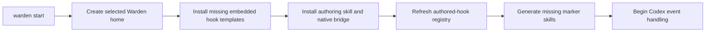
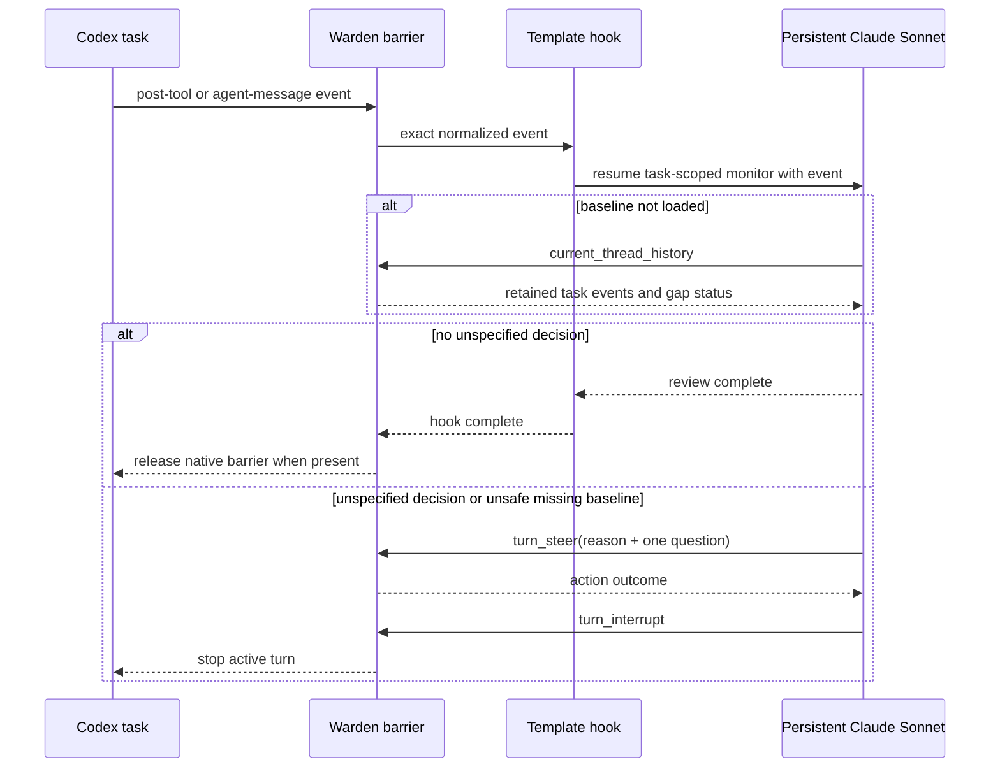

## Context

See `proposal.md` for motivation. Warden already performs startup reconciliation before its first hook-registry refresh, embeds the hook-authoring skill in the CLI, generates marker skills from discovered authored hooks, and exposes authenticated current-task history/steer/interrupt actions to hook-owned agent subprocesses. Persistent provider sessions are keyed by provider, hook, logical session name, and source Codex task.

The missing pieces are a source-controlled template catalog, non-destructive installation into the selected Warden home, and per-hook Claude model selection. The codex-control dependency already supplies event ingestion and the native barriers/actions needed here; this change belongs entirely in Warden.

## Goals / Non-Goals

**Goals:**

- Make a useful example hook available on the first CLI startup and on any later startup where it is missing.
- Keep checked-in templates inspectable while making the compiled CLI self-contained.
- Preserve all existing user-authored hook content.
- Make the monitoring conversation durable per source Codex task and explicitly use Claude Sonnet.
- Make the stop path visible and ordered: explain/ask first, interrupt second.

**Non-Goals:**

- Synchronizing later template revisions into an existing user copy.
- Creating or checking in generated marker skills.
- Changing Codex's skill discovery behavior or native `hooks.json` ownership.
- Adding cross-task access, whole-machine process isolation, or new Python dependencies.
- Claiming that observer-only events can pause Codex retroactively.

## Decisions

### 1. Treat `.warden/warden-hooks/` as the canonical template tree

The first template will be `.warden/warden-hooks/unspecified-decisions/hook.py`. A small Rust catalog will name each shipped hook and embed each file at compile time. Startup will therefore work from a Homebrew/Cargo-installed binary with no source checkout.

Alternative considered: discover templates from the current working directory. That would make behavior depend on where the CLI is launched and would fail for packaged installations.

Generated skills remain outputs. Once the installed hook is discovered, the existing registry writes the marker with the exact body already required by Warden: `This skill is an activation marker for the local Warden service. Ignore`.

### 2. Install whole missing directories, never reconcile files inside an existing directory

For each catalog entry, onboarding checks `<warden-home>/warden-hooks/<name>`. If it exists in any form that Warden considers an existing destination, onboarding leaves it untouched. If absent, onboarding writes the complete template into a unique sibling staging directory, syncs it, and renames it into place. A concurrent destination winner is preserved rather than overwritten; failed staging is cleaned up and surfaced as an onboarding error.

This deliberately makes deletion the opt-in reset mechanism: deleting the entire template hook directory causes the next startup to install the current bundled version.

Alternative considered: copy missing files or compare hashes. Both approaches blur ownership and could silently change code the user has customized.

### 3. Reconcile templates before the existing initial registry refresh

Template installation becomes another step inside Codex onboarding, after Warden home creation and before control is handed to the normal runtime startup. The existing runtime then discovers installed templates and creates marker skills in the same startup. The onboarding report gains template outcomes so startup diagnostics and tests can distinguish installed from preserved templates.

### 4. Carry model as explicit agent-call metadata and bind it to persistent state

Python `claude.run(..., model=...)` and `claude.session(..., model=...)` pass an optional top-level `model` field through the authenticated agent gateway. The host trims and validates it, places it on the provider request, and the Claude driver appends `--model <value>` as separate argv entries. Omission adds no CLI argument and preserves today's default behavior.

Persistent session snapshots gain a backwards-compatible optional bound-model field. A new session records `Some("sonnet")`; every resume must request the same value. Existing snapshots without the field are treated as bound to provider-default (`None`), not silently rebound. This preserves logical session identity and produces an explicit mismatch error instead of opening a second conversation or changing models mid-conversation.

Warden assigns agent sends a daemon-local monotonic cursor after acquiring the logical session's operation lock. The exact hook event remains unchanged inside the provider message. This ordering cursor must not reuse raw event sequence values because native barriers and observed app-server events have independent sequence spaces and can otherwise create false sequence regressions in a mixed-event hook.

Alternative considered: include model in `SessionKey`. That would silently create multiple conversations for one hook/session/task name, violating the user's expectation of one continuing monitor.

### 5. Use the normal code-first hook API with no template-only configuration format

The template exports one async function decorated for:

- `POST_TOOL_USE`
- `POST_TOOL_USE_FAILURE`
- `AGENT_MESSAGE_COMPLETED`
- `blocking=True`
- grants for `CURRENT_THREAD_HISTORY`, `TURN_STEER`, and `TURN_INTERRUPT`

The function sends the exact `HookEvent` to `claude.session("unspecified-decision-monitor", model="sonnet", prompt=...)`. No YAML, process-lifetime field, event transform, dependency manifest, or marker implementation is introduced.

### 6. Let the persistent Claude monitor establish and retain the baseline

The standing prompt tells Claude that implementation is ongoing and that its first action in a new conversation is to use the granted current-task-history command. It identifies the initial user request and any referenced or pasted specifications as the authority, then retains that baseline in its persistent conversation. Every subsequent subscribed event is automatically appended as the next user message by the existing agent module.

If history reports a gap that prevents a trustworthy baseline, the prompt treats that as a reason to stop and request a restatement rather than guessing. A distinct source Codex task naturally receives a distinct persistent session because source task ID is already part of Warden's session key.

### 7. Claude owns the judgment and uses narrowly granted actions

The standing prompt defines consequential unspecified decisions with examples at product, architecture, interface, dependency, code-layout, file-layout, and operational-policy levels. It also says not to stop for reversible routine mechanics that do not constrain user-visible behavior or the codebase's intended structure.

If no decision is found, Claude returns without calling an action. If one is found, Claude must:

1. Call `turn_steer` with a concise explanation and exactly one question Codex must ask the user.
2. Inspect the action result.
3. Call `turn_interrupt` as its final Warden action so implementation cannot continue in that turn.

The template does not grant thread listing or arbitrary-thread actions. Warden's existing injected CLI restriction and invocation credential enforce those grants; prompt text is not the authority boundary.

### 8. Test deterministic boundaries separately from live model judgment

Unit/integration tests will verify template installation, preservation, marker discovery, metadata, model argv, session binding, and action ordering with isolated homes and fake provider executables/action gateways. An opt-in live smoke test will use the locally authenticated Claude CLI and a disposable controlled Codex task to prove the shipped template can preserve context, steer, and interrupt without making the ordinary test suite depend on a subscription or model variability.

## Risks / Trade-offs

- **Claude can misclassify a decision or fail to follow the action protocol** → Give it a precise standing prompt, test the tool path with a fake provider, surface hook/action failures, and keep the template user-editable after installation.
- **Monitoring every selected tool/response event adds latency and subscription usage** → Activation remains explicit per user message; only selected turns pay the blocking cost.
- **Failed-tool and intermediate observed agent events may arrive without a native barrier** → Run the requested blocking hook but report this limitation accurately; successful post-tool and final agent-response native events hold their barriers.
- **A user's copy does not receive template improvements** → Preserve user ownership by design; deleting or renaming the directory allows the next startup to install the current template.
- **History retention may omit the baseline in a long-running task** → Detect the gap and stop for a baseline restatement instead of approving work against incomplete context.
- **Steering can be rejected if Codex no longer considers the turn active** → Preserve and report the action outcome, then still request interruption; tests cover the supported native-barrier paths.

## Migration Plan

1. Release the CLI with the embedded catalog, model-selection support, and template.
2. On first startup after upgrade, install `unspecified-decisions` only where that hook directory is absent.
3. Let normal registry reconciliation generate its marker skill and expose it to newly loaded Codex skill bundles under existing Codex behavior.
4. Rollback by reverting the CLI. Existing installed template directories remain user-owned and are not deleted automatically; users may delete them manually if unwanted.
