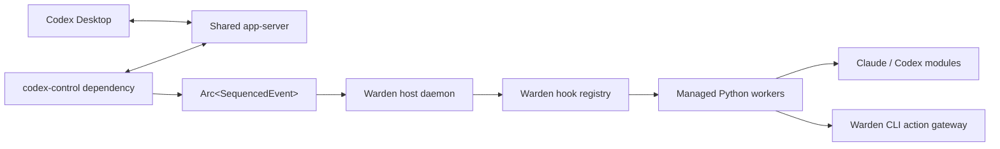

## Context

See `proposal.md` for motivation and the three capability specs for behavior. The existing `codex-control` dependency already owns the difficult shared-daemon boundary: it ingests ordered `Arc<SequencedEvent>` values, records them before fan-out, tracks thread and turn state, retains bounded event history, and exposes conservative `start`, `steer`, and `interrupt` outcomes. This host should consume those seams rather than duplicate app-server transport or Codex history.

The dependency currently exports lifecycle and delta streams plus observation and control methods through `Handle`. It does not yet expose typed skill-root management through `Handle`, even though its generated protocol contains `skills/extraRoots/set`, `skills/list`, and `skills/changed` types.

## Goals / Non-Goals

**Goals:**

- Make a Warden hook look like an ordinary Python function receiving `event`.
- Keep the skill mandatory but make it only an activation marker.
- Give every hook the exact source event plus a stable event kind.
- Make new or updated hooks selectable and executable without restarting loaded Codex tasks or editing native Codex hooks.
- Hide Python-worker, dependency, JSONL, and agent-process plumbing behind Warden defaults.
- Let hooks combine arbitrary Python logic, reusable agent modules, and selected Warden actions.

**Non-Goals:**

- Register new native Codex slash-command implementations.
- Mutate or hot-reload Codex native `hooks.json` bundles.
- Claim that observational `PreToolUse` events can block a Codex tool before execution.
- Sandbox the general filesystem, network, or shell behavior of hook subprocesses.
- Build a general distributed plugin runtime or stable ABI for arbitrary native libraries.

## Decisions

### 1. Keep the host above `codex-control`

The new daemon will be a Rust workspace in this repository with a Git/Cargo dependency on `codex-control`. It will subscribe to both Warden event planes but route hook activation and the initial event set through lifecycle-complete events. It will use the dependency's query APIs to recover retained context and preserve gap reporting rather than pretending all history is available.

The preferred dependency change is a narrow typed skill-management API on `Handle`, initially covering setting extra roots and requesting a forced skill list refresh. Exposing unrestricted raw app-server requests from `Handle` is rejected because it would weaken the dependency's explicit-action boundary. Opening a second private app-server connection only for skills is also rejected because it creates another lifecycle and reconnection owner.



### 2. Separate authored hooks from generated skills

Warden will maintain distinct roots under its local data directory:

```text
warden-hooks/          # authored hook.py and optional dependency files
modules/               # reusable modules exposed through the Warden Python package
generated-skills/      # generated marker skills only
runtimes/              # cached Python environments and workers
sessions/              # provider session metadata
```

Every valid hook directory produces one `generated-skills/<hook-name>/SKILL.md`. Its frontmatter contains the identity needed by Codex and its body is exactly:

```text
This skill is an activation marker for the local Warden service. Ignore
```

Warden calls the typed dependency API to attach `generated-skills/` on initial connection and reconnection. File changes produce a new skill revision and trigger skill discovery refresh. No authored hook logic is copied into the skill.

Keeping generated skills outside authored hook directories prevents Codex from becoming the execution runtime and makes it safe to regenerate the UI projection.

### 3. Resolve activation from Codex's selected-skill marker

The activation resolver first accepts a structured `type: "skill"` item when the app-server provides one. Current Codex Desktop app-server frames instead expose a prompt-UI selection as a leading `[$name](absolute/SKILL.md)` link in the user message, so the resolver also parses that exact marker representation. It canonicalizes the selected path and accepts it only when the path belongs to `generated-skills/` and the link name matches the marker directory. The relative skill directory maps directly to a validated hook identity.

An activation record is keyed by hook revision, thread ID, and turn ID. It begins when the starting turn input contains the marker and is removed on `TurnCompleted`, `TurnFailed`, or `TurnInterrupted`. A persistent Claude or Codex conversation may outlive the activation, but it receives nothing while no activation exists.

Arbitrary slash-command text remains inert. The marker-link parser exists because the installed Codex Desktop app-server does not retain a structured skill item in `turn/started`; canonical path containment and hook-directory identity remain authoritative.

### 4. Wrap, do not replace, `SequencedEvent`

The host will retain the source `Arc<SequencedEvent>` and create a small `HookEvent` view containing the normalized kind and any derived item ID or payload fields. Rust-side routing shares the existing allocation. The Python worker receives a serialized envelope containing both normalized fields and the original frame.

```rust
struct HookEvent {
    kind: HookEventKind,
    source: Arc<SequencedEvent>,
    item_id: Option<String>,
    payload: serde_json::Value,
}
```

`PreToolUse` maps to observation of a tool-like `item/started`; it is deliberately not described as a blocking hook. Completed tool items map according to terminal status. Completed agent-message items and completed turns remain separate kinds.

The router tracks the last delivered source sequence per activation so lifecycle replay after receiver lag does not duplicate a hook call. Raw deltas are not part of the first guaranteed hook enum; later revisions can add explicitly lossy delta kinds without changing lifecycle guarantees.

### 5. Use a code-first Python worker protocol

A hook directory requires only `hook.py`. The Warden Python package supplies the decorator, `HookEvent` enum, event object, Warden client, and reusable modules. The hook worker imports the module and returns registration metadata during a startup handshake. That avoids a parallel YAML representation of the same Python function.

An optional `requirements.txt` declares third-party dependencies. Warden creates a virtual environment using the configured Python interpreter, installs the Warden Python package plus declared dependencies, and caches the environment by the content hash of the runtime contract and dependency file. A dependency change builds a candidate environment before replacing the last valid hook revision.

Each loaded Python hook uses a supervised JSONL worker managed by Warden. Keeping the worker resident is a daemon optimization, not hook configuration. Calls contain an invocation ID and serialized `HookEvent`; results contain success, structured action requests where applicable, logs, or a structured failure. Worker exit, timeout, or malformed output fails that invocation and triggers bounded restart without taking down other hooks.

Dynamic native libraries and embedding CPython directly were rejected for the first version: both add lifecycle or ABI complexity without improving the hook-author experience.

### 6. Make fresh and persistent agent calls different APIs

The Warden Python package exposes provider modules with two simple shapes:

```python
await claude.run(event, prompt="...")
session = claude.session(name="monitor", persistent=True)
await session.send(event)
```

The same shape applies to Codex. `run` always starts a fresh conversation. A named persistent session is keyed by provider, hook identity, session name, and source Codex thread unless the hook deliberately chooses another supported scope later. Provider process lifetime is private to the driver: the driver may keep a JSON stream open or resume a saved session ID after spawning a new process.

The full event envelope is automatically the provider's next user message. The hook's prompt supplies the monitoring instruction; there is no routine event-to-prompt module. Sends to one persistent provider conversation are serialized by source sequence.

Claude will run in normal authenticated mode so the local subscription/keychain remains usable; `--bare` is unsuitable for this path. Provider drivers will use structured output modes and retain only the session metadata required for resume and diagnostics.

### 7. Treat Warden actions as a daemon API with a CLI projection

The daemon owns the live `codex-control::Handle`. Hook subprocesses receive a local socket location and short-lived invocation credential through their environment. The `warden` CLI reads those values automatically and sends typed requests to the daemon.

The hook-creation skill asks the user to select Warden actions only when the hook uses an agent. The selection becomes an action grant attached to the hook revision. Current-event and current-thread commands infer their target from the invocation; cross-thread listing and targeting require explicit grants.

The gateway validates the command and target against the grant, then calls the existing `Handle` observation or control API. This is application-level authorization for Warden operations, not an OS sandbox. The subprocess may have other machine capabilities under the local user's account, which remains outside this change.

MCP is not required for the initial implementation. A future MCP adapter can project the same action catalog without changing the daemon's action model.

### 8. Publish revisions atomically

The file watcher treats source and dependency changes as candidates. Warden validates hook import/handshake, prepares dependencies, and generates the marker skill before publishing a revision. A failed candidate leaves the last valid revision active. Existing invocation records retain their original revision; later activations receive the new revision.

Removing a hook prevents new activations and removes its generated skill. Existing invocations are allowed to reach their source turn's terminal event unless their worker is no longer runnable, in which case they fail observably.

## Risks / Trade-offs

- **Codex Desktop may refresh its skill selector differently across versions** → Use typed `skills/extraRoots/set`, observe `skills/changed`, force a skills rescan where supported, and add a live version-compatibility test.
- **`PreToolUse` arrives at tool-item start and cannot enforce a pre-execution veto** → Document it as observational and reserve blocking semantics for a future explicitly supported interception path.
- **A daemon restart can miss the original marker input for an already-running turn** → Reconcile from retained turn input when available; otherwise report the coverage gap and do not invent an activation.
- **User Python can hang, crash, or emit unbounded output** → Supervise workers, bound messages and queues, apply timeouts, and isolate failures per hook revision.
- **Dependency installation can execute package build logic under the local user** → Make the hook-creation flow state that dependencies are trusted local code and show what will be installed; this change does not promise package sandboxing.
- **Persistent agent sessions can accumulate context or cost** → Keep persistence explicit, serialize sends, expose session status and reset, and retain usage metadata when the provider reports it.
- **Agent subprocesses can use machine capabilities beyond Warden actions** → Enforce only the Warden action grant and avoid claiming broader sandbox guarantees.

## Migration Plan

1. Add the narrow skill-management seam to `codex-control` and release or pin a compatible Warden revision.
2. Bootstrap the host daemon with dependency connection, local paths, health reporting, and action socket.
3. Add event normalization and marker-skill activation with a test hook executor.
4. Add the Python package, environment manager, and supervised worker.
5. Add the Warden CLI action projection and hook-creation skill.
6. Add Claude and Codex provider modules, first fresh calls and then persistent sessions.
7. Enable file watching and atomic revision swaps after the static path passes integration tests.

Rollback disables the host daemon and removes its generated skill root from managed app-server state. Authored hook source and provider session metadata remain on disk; Codex native hook configuration is unchanged.
